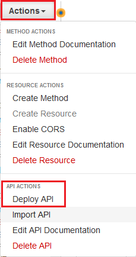
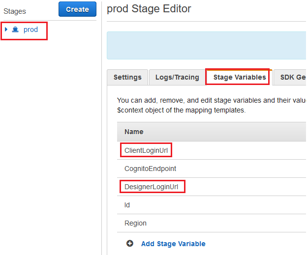

# Setup Custom Domain to use for QnABot Designer and Client

This readme provides information on how to setup a custom domain name and configure AWS QnABot solution to use the custom domain name for the Designer, and Client user interfaces. 
The setup and configuration involve the following steps:

## Step 1: Setup custom domain name for API Gateway
Use the AWS Account and AWS Region where you have deployed the AWS QnABot solution for the below steps. 
Follow the steps outlined in the below link to setup:
https://docs.aws.amazon.com/apigateway/latest/developerguide/how-to-custom-domains.html 

-	Registering a domain name
-	Creating DNS records
-	Creating a SSL certificate for the custom domain name
-	Creating a custom domain in API Gateway

`Note: Disable the default API gateway endpoint since the custom domain name will be used.`

## Step 2: Custom domain API Mapping setup in API Gateway
When mapping the API to the custom domain in API Gateway for the QnABot deployment, use the below settings: 

Create two mappings:

##### Mapping 1: 
- `API` = select the QnABot deployment you would like to use. The QnABot API will be named with the same name as the CloudFormation Stack name you used when you deployed the AWS QnABot solution
- `Stage` = `prod`	- this is the default stage created for the QnABot deployment

##### Mapping 2: 
- `API` = select the QnABot deployment you would like to use. The QnABot API will be named with the same name as the CloudFormation Stack name you used when you deployed the AWS QnABot solution
- `Stage` = `prod`	- this is the default stage created for the QnABot deployment
- `Path` = `prod`	- for routing requests

## Step 3: Update QnABot API Resources in API Gateway
- Navigate to API Gateway and select the QnABot API
- The QnABot API will be named with the same name as the CloudFormation Stack name you used when you deployed the AWS QnABot solution
- Navigate to the Resources section from the menu

### Step 3a: Update the `/pages/client` resource
- Select the `GET` method for `/pages/client` resource
- Click `Integration Response`
- Expand the `302` Method Response Status
- Edit the `location` Response header and replace the API Gateway endpoint with your custom domain name
The API Gateway endpoint will have the endpoint such as: `{api-id}.execute-api.{region}.amazonaws.com`
- Please make note of the URL encoding in the values
- Click the `{tick}` icon to update the value
- And then click the `Save` button

### Step 3b: Update the `/pages/designer` resource
- Select the `GET` method for `/pages/designer` resource
- Click `Integration Response`
- Expand the `302` Method Response Status
- Edit the `location` Response header and replace the API Gateway endpoint with your custom domain name
The API Gateway endpoint will have the endpoint such as: `{api-id}.execute-api.{region}.amazonaws.com`
- Please make note of the URL encoding in the values
- Click the `{tick}` icon to update the value
- And then click the `Save` button

### Step 4: Update QnABot Cognito User Pool
In order to access the QnABot Designer user interface, the deployment sets up authentication using Amazon Cognito. We will update the User pool settings to update the Callback URLs to use the custom domain name. 
- Navigate to the Amazon Cogito console 
- Click on `User Pools`
- Click the QnABot user pool
The QnABot User Pool will be named with the same name as the CloudFormation Stack name you used when you deployed the AWS QnABot solution – such as: UserPool-{stack name}
- Navigate to `App Integration` --> `App client settings`

#### Update the `Callback URL(s)` for App clients: `UserPool-{stackname}-client`
- use the custom domain name instead of the API Gateway endpoint. For example: 
`https://YOUR_CUSTOM_DOMAIN_NAME/prod/static/client.html`
- Click `Save Changes` button

#### Update the `Callback URL(s)` for App clients: `UserPool-{stackname}-designer`
- use the custom domain name instead of the API Gateway endpoint. For example: 
`https://YOUR_CUSTOM_DOMAIN_NAME/prod/static/index.html`
- Click `Save Changes` button

## Step 5: Deploy API
Now that we have updated the configurations, we will now need to deploy the API for the changes to take effect. 

- Click the `Actions` button
- Click `Deploy API`

- For the following: 
  - `Deployment stage`: select `prod`
  - `Deployment description`: enter `Updated {location} response header in GET method for /pages/designer and /pages/client resources`
- Click the `Deploy` button to deploy the API

## Step 6: Update the API Stage variables
Once the API is deployed, you will be navigated to the Stage Editor page. 
- Click the Stage Variables tab
- Update the values for `ClientLoginUrl` and `DesignerLoginUrl` variables to use the custom domain name. 

## Step 7: Test the updates using the custom domain name
Launch the QnABot designer in a new browser session using the custom domain name (`https://YOUR_CUSTOM_DOMAIN_NAME/prod/pages/designer`) to test the updates.

-----
